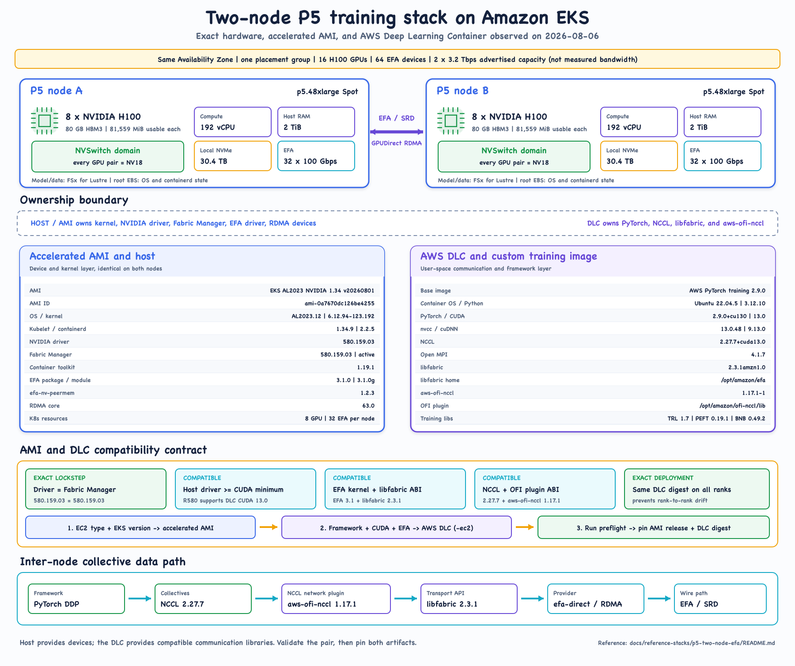
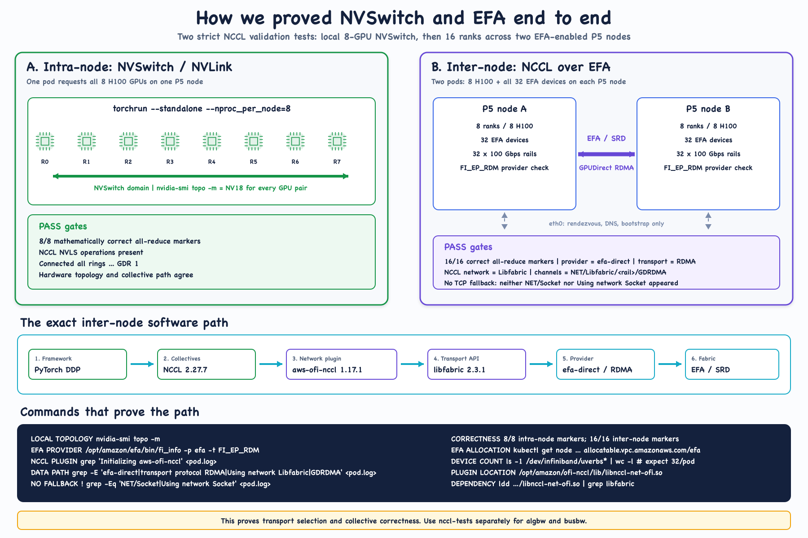

# EKS GPU Communication Lab

Visual explanations and reproducible validation for GPU communication on
Amazon EKS. The repository connects seven layers that are often discussed in
isolation:

1. GPU anatomy: SM execution, caches, HBM capacity, and DMA engines.
2. Physical GPU data paths: NVLink, NVSwitch, PCIe, EFA, and GPUDirect RDMA.
3. Communication semantics: NCCL collectives versus NIXL data movement.
4. The host/container contract: accelerated EKS AMIs, AWS Deep Learning
   Containers (DLCs), and purpose-built inference images.
5. Measured training evidence: intra-node NCCL over NVSwitch and inter-node
   NCCL over EFA on a two-node P5 fleet.
6. Measured inference evidence: homogeneous routing plus a separate
   prefill/decode KV-transfer experiment through NIXL, libfabric, and EFA on
   the same P5 shape.
7. Observability design: EFA device counters, GPU telemetry, transport proof,
   and application metrics correlated without overstating what any one signal
   proves.

## 15-minute presentation

View the deployed, self-contained HTML presentation:
[GPU Communication on EKS: Proven, Not Assumed](https://murubhas.github.io/eks-gpu-communication-lab/docs/eks-gpu-communication-15min-demo.html).

The versioned source is
[docs/eks-gpu-communication-15min-demo.html](docs/eks-gpu-communication-15min-demo.html).

## Start here

| Step | Read or run | Purpose |
| --- | --- | --- |
| 1 | [GPU anatomy](docs/concepts/00-gpu-anatomy.md) | Learn where compute happens and where model state lives. |
| 2 | [GPU data paths](docs/concepts/01-gpu-data-paths.md) | Understand where bytes move within and between nodes. |
| 3 | [NCCL versus NIXL](docs/concepts/02-nccl-vs-nixl.md) | Separate collectives from inference-state transfer. |
| 4 | [Lab index](labs/README.md) | Choose the training collective or inference-state-transfer path. |
| 5 | [Two-node P5 reference stack](docs/reference-stacks/p5-two-node-efa/README.md) | Inspect an exact hardware, AMI, and runtime pairing. |
| 6 | [AMI and DLC selection](docs/reference-stacks/p5-two-node-efa/ami-dlc-selection.md) | Choose each training artifact and validate its compatibility boundary. |
| 7 | [P5 NCCL/EFA lab](labs/p5-nccl-efa/README.md) | Reproduce inventory, NVSwitch, and EFA checks. |
| 8 | [Qwen 27B training comparison](labs/p5-nccl-efa/results/qwen27b-ddp-training-comparison.md) | Compare measured G7e, G6e, and P5 training time, telemetry, and economics. |
| 9 | [P5 NIXL/EFA serving inventory](docs/reference-stacks/p5-two-node-efa/nixl-efa-serving-inventory.md) | Inspect the exact host, llm-d image, NIXL, libfabric, and EFA contract. |
| 10 | [Why this llm-d AWS runtime](docs/decisions/0001-select-llm-d-aws-for-nixl-efa.md) | Review the image-selection decision, alternatives, and requalification gates. |
| 11 | [P5 NIXL/EFA inference lab](labs/p5-nixl-efa/README.md) | Reproduce the routing and matched homogeneous-versus-P/D method. |
| 12 | [P5 inference benchmark](labs/p5-nixl-efa/results/p5-efa-inference-benchmark.md) | Read the measured routing, P/D, latency, throughput, and cost result. |
| 13 | [Observability](docs/observability/README.md) | Understand the telemetry layers and the planned EFA-to-Prometheus path. |
| 14 | [Evidence boundaries](docs/evidence-boundaries.md) | See what was measured and what remains conceptual. |

## GPU anatomy


## GPU data paths


## NCCL versus NIXL


## Measured P5 reference stack





## Measured P5 NIXL/EFA serving stack


## Evidence labels

The repository deliberately distinguishes architecture from experiment results:

| Content | Evidence level |
| --- | --- |
| GPU anatomy diagram | Conceptual architecture grounded in vendor documentation |
| GPU data-path diagram | Conceptual architecture grounded in vendor documentation |
| NCCL versus NIXL diagram | Conceptual architecture grounded in vendor documentation |
| Two-node P5 hardware/AMI/DLC stack | Observed inventory from 2026-08-06 |
| Intra-node NCCL/NVSwitch path | Experimentally verified |
| Inter-node NCCL/EFA/GPUDirect RDMA path | Experimentally verified |
| Qwen 27B DDP training on two P5 nodes | Experimentally measured; cross-platform comparison is directional |
| NIXL `LIBFABRIC` backend over EFA | Experimentally verified through application runtime evidence |
| Homogeneous versus P/D application behavior | Experimentally measured for one long-context synthetic workload |
| NIXL transport bandwidth | Not measured; run `nixlbench` independently |
| EFA counters in Prometheus | Design documented; exporter deployment and workload correlation tagging are not implemented |

## Repository layout

```text
docs/       Concepts, decisions, observability, reference architecture, and generated visuals
labs/       Sequential training and inference experiments with explicit gates
tools/      Diagram source generators
scripts/    Public-content, manifest, and generated-asset validation
```

## Regenerate the diagrams

```bash
npm install
npm run build:diagrams
```

Code-generated diagrams commit both editable SVG and shareable PNG outputs. The
hand-note GPU anatomy illustration is committed as a shareable PNG. CI rebuilds
the code-generated diagrams and fails when their outputs differ from source.

## Safety

The P5 labs can request every GPU and EFA device on two `p5.48xlarge` nodes.
They do not provision or resize infrastructure. Review cost and capacity,
provide two suitable nodes, and run only one full-fleet phase at a time.

Do not commit kubeconfig files, credentials, Terraform state, private registry
URIs, account IDs, or unredacted production logs. Run:

```bash
npm run check
```

before opening a pull request.

## License

MIT. See [LICENSE](LICENSE).
