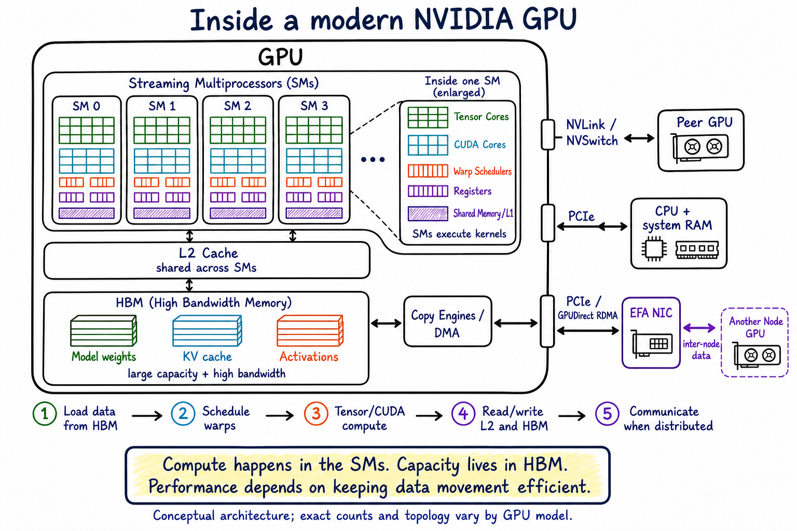

# GPU anatomy: compute, memory, and data movement

This hand-note diagram supplies the component-level foundation for the other
communication diagrams in this repository. It is a conceptual architecture,
not a literal die floorplan; component counts and physical topology vary by
GPU generation and model.

## Read it from compute to capacity

- Streaming Multiprocessors (SMs) execute GPU kernels. Tensor Cores accelerate
  matrix operations, while CUDA Cores execute general arithmetic operations.
- Warp schedulers issue work to groups of threads. Registers and shared
  memory/L1 are the closest storage to an SM.
- L2 cache is shared across SMs and sits between on-chip execution resources
  and device memory.
- High Bandwidth Memory (HBM) provides the large-capacity device-memory tier.
  LLM workloads place model weights, KV-cache blocks, and active tensors such
  as activations there.
- Copy engines and DMA move data without making SMs perform each copy
  instruction directly.

## Read the exits as different paths

- NVLink and NVSwitch connect peer GPUs within a node when the instance
  topology provides them.
- PCIe connects the GPU to host processors, system memory, storage, and network
  devices.
- An EFA NIC is outside the GPU. With a validated GPUDirect RDMA path, bulk data
  can move between registered GPU memory and the NIC without staging through
  host DRAM. CPU processes still handle control, metadata, and setup work.

## Presenter memory line

> Compute happens in the SMs. Capacity lives in HBM. Performance depends on
> keeping data movement efficient.

Continue with [GPU data paths](01-gpu-data-paths.md) to see how those components
connect within and between nodes.

## References

- [NVIDIA CUDA C++ Programming Guide](https://docs.nvidia.com/cuda/cuda-c-programming-guide/)
- [NVIDIA deep-learning GPU performance background](https://docs.nvidia.com/deeplearning/performance/dl-performance-gpu-background/index.html)
- [Amazon EC2 Elastic Fabric Adapter](https://docs.aws.amazon.com/AWSEC2/latest/UserGuide/efa.html)
