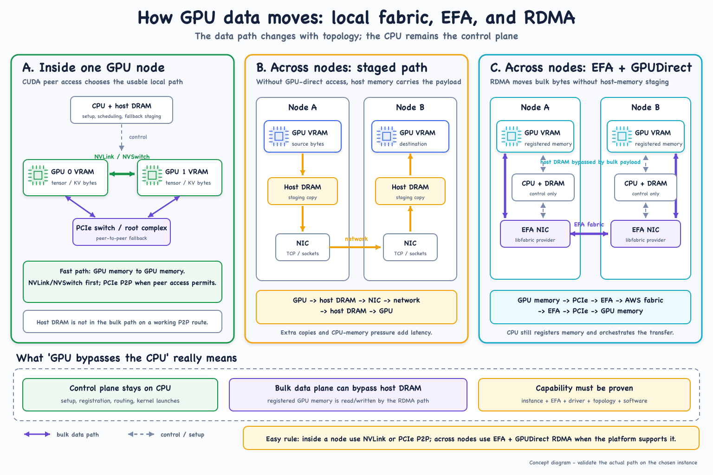

# GPU data paths: NVLink, PCIe, EFA, and GPUDirect RDMA



## The three paths

### 1. Intra-node peer access

When CUDA peer access is available, GPU traffic can stay GPU-to-GPU. NCCL
normally prefers NVLink or NVSwitch when present and can use PCIe peer-to-peer
when the topology permits it.

PCIe peer access is topology-dependent. Crossing unsupported PCIe root
complexes can force a host-staged fallback even within one node. Verify the
actual path instead of inferring it from GPU count.

### 2. Host-staged inter-node transfer

Without a GPU-direct path, bytes move from source GPU memory into host DRAM,
through the network, into destination host DRAM, and finally into destination
GPU memory. The extra copies consume memory bandwidth and CPU participation.

### 3. EFA with GPUDirect RDMA

Registered GPU memory is accessible to the EFA data path. Bulk payload can
travel from source GPU memory through EFA and into destination GPU memory
without staging in host DRAM.

"GPU bypasses the CPU" is shorthand, not literal. CPU processes still create
connections, register memory, exchange metadata, schedule operations, and
launch kernels. The bulk payload avoids CPU-mediated host-memory copies.

## Capability gate

EFA support alone is insufficient. The complete path depends on:

- An EFA-capable instance and correctly attached interfaces.
- A compatible accelerated AMI, kernel, EFA module, RDMA core, and NVIDIA
  driver.
- GPU peer-memory or GPUDirect support.
- Correct PCIe and NUMA topology.
- A container with compatible libfabric and communication libraries.
- Kubernetes allocating the EFA devices to the pod.
- The application selecting EFA instead of silently falling back to sockets.

## Verification

```bash
nvidia-smi topo -m
/opt/amazon/efa/bin/fi_info -p efa -t FI_EP_RDM
```

For NCCL, enable `NCCL_DEBUG=INFO` and inspect the provider, transport, and
channel path. Use `nccl-tests` when bandwidth measurements such as `algbw` and
`busbw` are required.

## References

- [Amazon EC2 Elastic Fabric Adapter](https://docs.aws.amazon.com/AWSEC2/latest/UserGuide/efa.html)
- [Amazon EKS: run ML training with EFA](https://docs.aws.amazon.com/eks/latest/userguide/node-efa.html)
- [NVIDIA NCCL troubleshooting](https://docs.nvidia.com/deeplearning/nccl/user-guide/docs/troubleshooting.html)
