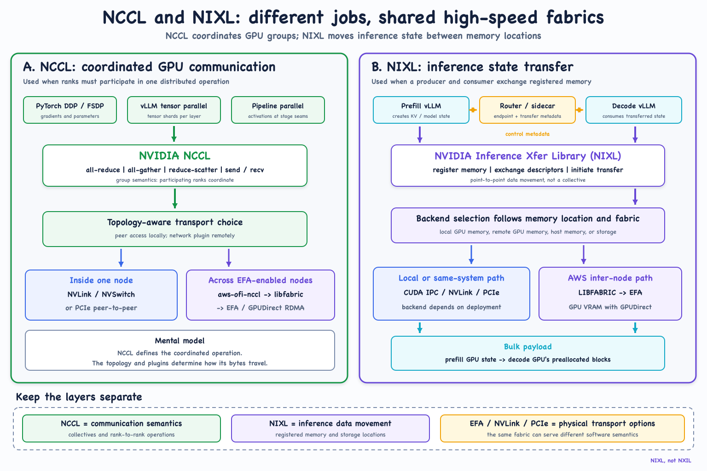

# NCCL versus NIXL



NCCL and NIXL can use related fabrics, but they solve different problems.

## NCCL

NCCL answers: **what coordinated operation should this GPU group perform?**

Examples include:

- All-reduce for Distributed Data Parallel training.
- All-gather and reduce-scatter for sharded training.
- Repeated collectives for tensor parallelism.
- Point-to-point send/receive for pipeline stages.

Inside a node, NCCL can use NVLink, NVSwitch, or PCIe peer access. On AWS,
`aws-ofi-nccl` maps NCCL's network-plugin API to libfabric and EFA:

```text
NCCL -> aws-ofi-nccl -> libfabric efa provider -> EFA / SRD
```

Without a working OFI plugin, NCCL can fall back to its socket transport.
Always inspect the logs.

## NIXL

NIXL answers: **how should registered inference state move between memory or
storage locations?**

In prefill/decode disaggregation, a prefill worker transfers KV-cache state
into blocks prepared by a decode worker. Routing and sidecar components carry
endpoint selection and transfer metadata; NIXL carries the bulk state.

On AWS, NIXL can use its native `LIBFABRIC` backend over EFA:

```text
NIXL -> native LIBFABRIC backend -> libfabric efa provider -> EFA / SRD
```

Local backends may use CUDA IPC, NVLink, or PCIe depending on deployment and
topology.

## Easy distinction

| Layer | Question answered |
| --- | --- |
| NCCL | What collective or rank-to-rank operation should GPUs perform? |
| NIXL | How should addressable inference state move? |
| EFA/NVLink/PCIe | Which physical transport carries the bytes? |
| Router | Which ready endpoint should receive the request? |

NIXL does not replace NCCL. EFA is not a collective library. RDMA is not a
router. The same fabric can support different software semantics.

## Measured examples in this repository

- [NCCL over EFA validation](../../labs/p5-nccl-efa/README.md)
- [NIXL over EFA serving inventory](../reference-stacks/p5-two-node-efa/nixl-efa-serving-inventory.md)
- [Homogeneous versus P/D benchmark](../../labs/p5-nixl-efa/results/p5-efa-inference-benchmark.md)

## References

- [NVIDIA NCCL](https://docs.nvidia.com/deeplearning/nccl/index.html)
- [Amazon EC2: EFA and NCCL](https://docs.aws.amazon.com/AWSEC2/latest/UserGuide/efa-start-nccl.html)
- [Amazon EC2: EFA and NIXL](https://docs.aws.amazon.com/AWSEC2/latest/UserGuide/efa-start-nixl.html)
