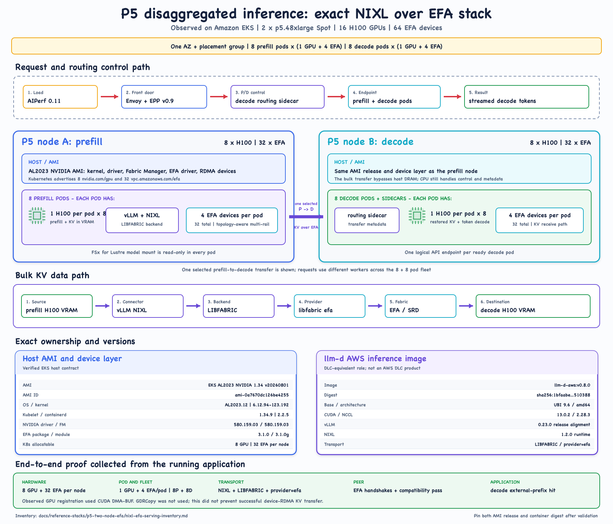

# P5 NIXL over EFA inference lab

This lab records two controlled inference studies on the same two-node
`p5.48xlarge` Amazon EKS fleet:

1. Kubernetes Service versus llm-d routing for a homogeneous 16-replica vLLM
   deployment.
2. A matched homogeneous control versus 8 prefill and 8 decode workers using
   NIXL, libfabric, and EFA for KV-cache transfer.

The observed result is in the
[P5 inference benchmark report](results/p5-efa-inference-benchmark.md). The
exact host and image inventory is in the
[P5 serving reference stack](../../docs/reference-stacks/p5-two-node-efa/nixl-efa-serving-inventory.md).
The image-selection rationale is in
[ADR 0001](../../docs/decisions/0001-select-llm-d-aws-for-nixl-efa.md).



## Evidence boundary

The lab proved that the application selected the NIXL `LIBFABRIC` backend,
libfabric selected the `efa` provider, EFA peers connected across nodes, and
decode workers consumed transferred prefix state. It also measured application
behavior with AIPerf.

It did not run `nixlbench`, isolate transport bandwidth from the complete P/D
stack, or establish a universal P/D performance percentage. Routing, phase
separation, and KV transfer changed together in the P/D arm.

## Safety and cost gate

The measured topology consumed both P5 nodes completely: 16 H100 GPUs and 64
EFA devices. Nothing in this lab provisions or resizes infrastructure. Before
launching model pods, verify that the nodes are intentionally available, no
other workload owns them, and cleanup responsibility is explicit.

Use a dedicated namespace and labels rather than hostnames in reusable
manifests. The observed run placed the two nodes in one Availability Zone and
one cluster placement group.

## Prerequisites

- Two EFA-enabled `p5.48xlarge` nodes in one Availability Zone, preferably in
  one cluster placement group.
- A security group that permits EFA traffic between members of the group.
- An EKS accelerated NVIDIA AMI with the NVIDIA driver, matching Fabric
  Manager, EFA kernel module, and RDMA device layer.
- NVIDIA and EFA device plugins exposing `nvidia.com/gpu` and
  `vpc.amazonaws.com/efa`.
- The same pinned model-server image digest on every worker.
- A model artifact available to each pod, such as a read-only FSx for Lustre
  mount.
- Gateway API Inference Extension and llm-d routing components for the llm-d
  and P/D arms.
- Prometheus Operator, vLLM PodMonitors, and DCGM exporter for application and
  hardware evidence.
- An in-cluster runner with AIPerf 0.11.0.

## Fixed deployment contract

Keep these values fixed when comparing the two execution topologies:

| Contract | Homogeneous control | P/D arm |
| --- | --- | --- |
| Physical fleet | 2 P5 nodes, 16 H100 | Same |
| Container | Same pinned llm-d AWS image | Same |
| Model | Same FP8 checkpoint | Same |
| Workers | 16 homogeneous | 8 prefill + 8 decode |
| GPU allocation | 1 GPU per pod | 1 GPU per pod |
| EFA allocation | Not required for local KV | 4 EFA devices per model pod |
| Core vLLM settings | Identical | Identical |
| External KV transfer | Disabled | `NixlConnector`, `LIBFABRIC` |
| Front door | Kubernetes Service | Envoy/EPP with P/D filters |

The measured P/D engine contract was:

```text
--tensor-parallel-size 1
--max-model-len 8192
--max-num-seqs 1
--max-num-batched-tokens 8192
--enable-prefix-caching
--enable-chunked-prefill
--kv-cache-dtype fp8_e4m3
--block-size 128
--gpu-memory-utilization 0.90
--kv-transfer-config '{"kv_connector":"NixlConnector","kv_role":"kv_both","kv_connector_extra_config":{"backends":["LIBFABRIC"]}}'
```

Each P/D model pod also set:

```text
FI_PROVIDER=efa
FI_EFA_USE_DEVICE_RDMA=1
VLLM_NIXL_SIDE_CHANNEL_PORT=5600
```

The decode routing sidecar handled request and transfer metadata. It was not in
the bulk KV path. KV tensors moved between model-server processes through NIXL,
libfabric, and EFA.

## Phase 1: inventory and independent transport checks

First run the [P5 NCCL/EFA inventory lab](../p5-nccl-efa/README.md) to verify
the host, image, GPU, EFA, and libfabric contracts. NCCL and NIXL have different
semantics, but both depend on a working EFA/libfabric foundation.

Capture the live llm-d container inventory before the smoke test:

```bash
export CONTEXT='<your-EKS-context>'
export NAMESPACE='gpu-communication-lab'
export POD='<running-model-pod>'

bash labs/p5-nixl-efa/scripts/inventory_llmd_aws_runtime.sh \
  > llmd-aws-runtime-inventory.txt
```

For transport-only NIXL evidence, follow the AWS `nixlbench` procedure with:

```text
--backend LIBFABRIC
--initiator_seg_type VRAM
--target_seg_type VRAM
```

The application smoke below complements that microbenchmark; it does not
replace it.

## Phase 2: application smoke gate

Do not benchmark until every gate passes:

1. All model pods are Ready and expose the expected model through `/v1/models`.
2. Every P/D model pod received one GPU and four EFA resources.
3. Logs show NIXL available, the `LIBFABRIC` backend, and `provider=efa`.
4. Logs show the assigned EFA devices, peer insertion or handshake, and a
   successful NIXL compatibility check.
5. One long-prompt request completes through the P/D endpoint.
6. Decode logs show an external-prefix-cache hit for the smoke request.
7. Prometheus sees every vLLM worker and DCGM sees all 16 GPUs.

Example checks, with names supplied by the operator:

```bash
kubectl --context "$CONTEXT" -n "$NAMESPACE" get pods -o wide

kubectl --context "$CONTEXT" -n "$NAMESPACE" logs <model-pod> -c modelserver | \
  grep -E 'NIXL|LIBFABRIC|provider=efa|EFA|compatibility|TransferTopology|external prefix'

kubectl --context "$CONTEXT" -n "$NAMESPACE" get pod <model-pod> \
  -o jsonpath='{.spec.containers[?(@.name=="modelserver")].resources}'
```

Stop at the first failed gate. Do not stack performance tuning on an unproven
transport path.

## Phase 3: routing A/B/B/A

The routing experiment used 16 homogeneous workers and changed only the front
door. It ran 25-minute closed-loop arms with a 10-minute cooldown:

```text
A1: Kubernetes Service
B1: llm-d Envoy/EPP
B2: llm-d Envoy/EPP
A2: Kubernetes Service
```

Set the public-safe script inputs explicitly:

```bash
export CONTEXT='<your-EKS-context>'
export NAMESPACE='gpu-communication-lab'
export RUNNER='aiperf-runner'
export MODEL='<served-model-name>'
export CONCURRENCY=48
export DURATION_SECONDS=1500

bash labs/p5-nixl-efa/scripts/run_routing_arm.sh A1 http://<service-name>/v1
# Cool down for 10 minutes and require queue depth to return to zero.
bash labs/p5-nixl-efa/scripts/run_routing_arm.sh B1 http://<llm-d-service>/v1
```

Continue B2 and A2 only after the same cooldown gate. Record exact UTC windows
for Prometheus and DCGM correlation.

## Phase 4: matched homogeneous and P/D arms

Use the same image, model, fleet, vLLM settings, request shape, and pricing
basis. Run the homogeneous control first, cool down, then run P/D:

```bash
export CONTEXT='<your-EKS-context>'
export NAMESPACE='gpu-communication-lab'
export RUNNER='aiperf-runner'
export CONCURRENCY=16
export REQUEST_COUNT=400
export WARMUP_REQUEST_COUNT=16
export ISL=4096
export OSL=128

bash labs/p5-nixl-efa/scripts/run_pd_arm.sh \
  homogeneous http://<homogeneous-service>/v1 <served-model-name>

# Cool down and verify queue depth, request counters, and GPU utilization reset.

bash labs/p5-nixl-efa/scripts/run_pd_arm.sh \
  pd-nixl-efa http://<pd-router-service>/v1 <served-model-name>
```

The scripts use streaming, seed 42, thinking disabled, EOS ignored, and no HTTP
connection reuse. Those choices create a repeatable saturation workload; they
do not represent every production request distribution.

## Phase 5: summarize and correlate

Copy each AIPerf directory from the runner, then create a comparison:

```bash
python3 labs/p5-nixl-efa/scripts/summarize_pd_runs.py \
  --baseline <homogeneous-artifact-dir> \
  --pd <pd-artifact-dir> \
  --spot-fleet-hourly-usd <fleet-hourly-usd> \
  --ondemand-fleet-hourly-usd <fleet-hourly-usd> \
  --output pd-comparison-summary.json
```

Capture Prometheus evidence for the exact UTC window:

```bash
python3 labs/p5-nixl-efa/scripts/collect_prometheus_window.py \
  --prometheus-url http://127.0.0.1:9090/api/v1 \
  --start <UTC-start> \
  --end <UTC-end> \
  --namespace "$NAMESPACE" \
  --pod-regex '<model-pod-regex>' \
  --gpu-host-regex '<P5-host-regex>' \
  --epp-service '<EPP-service-name>' \
  --output prometheus-window.json
```

Read throughput, TTFT, E2E, TST, and ITL together. A working EFA path does not
guarantee that a chosen P:D ratio or routing policy improves every percentile.

## Cleanup

Scale or delete only resources created for the lab. Confirm no model, router,
or benchmark pods remain before reducing the external node group. Infrastructure
resize commands are deliberately excluded because ownership varies by cluster.

## Primary references

- [AWS EC2: Get started with EFA and NIXL](https://docs.aws.amazon.com/AWSEC2/latest/UserGuide/efa-start-nixl.html)
- [AWS ML Blog: Disaggregated inference on AWS powered by llm-d](https://aws.amazon.com/blogs/machine-learning/introducing-disaggregated-inference-on-aws-powered-by-llm-d/)
- [llm-d: RDMA and networking configuration](https://llm-d.ai/docs/dev/infrastructure/rdma)
- [llm-d operations guide for vLLM disaggregation](https://llm-d.ai/docs/architecture/advanced/disaggregation/operations-vllm)
